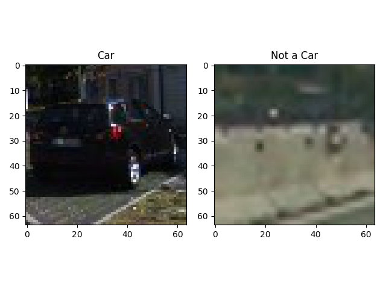
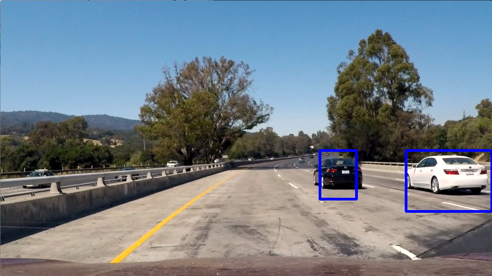
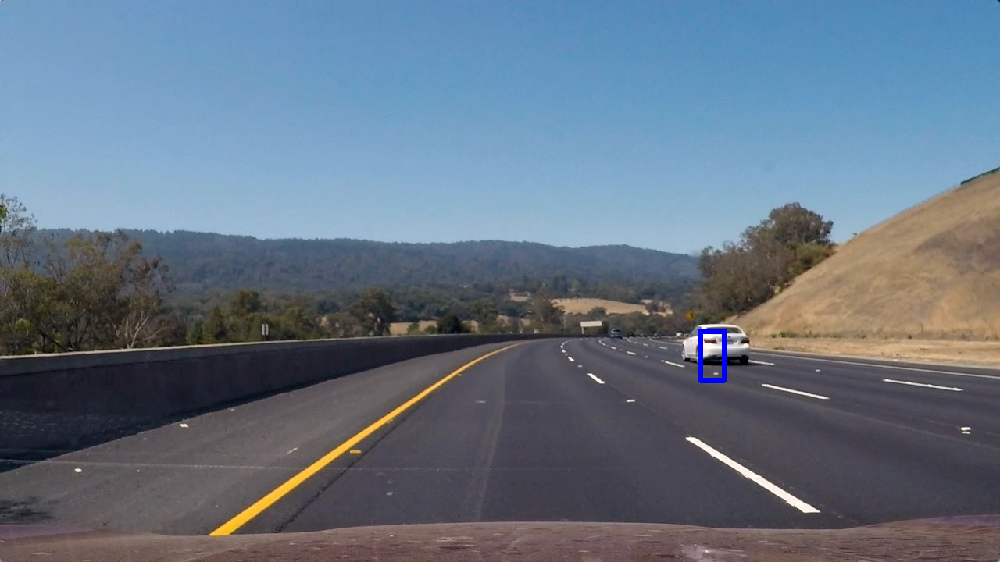
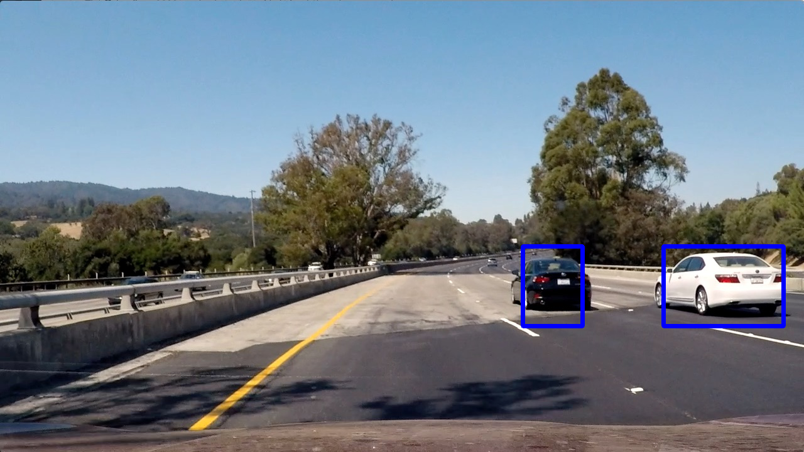
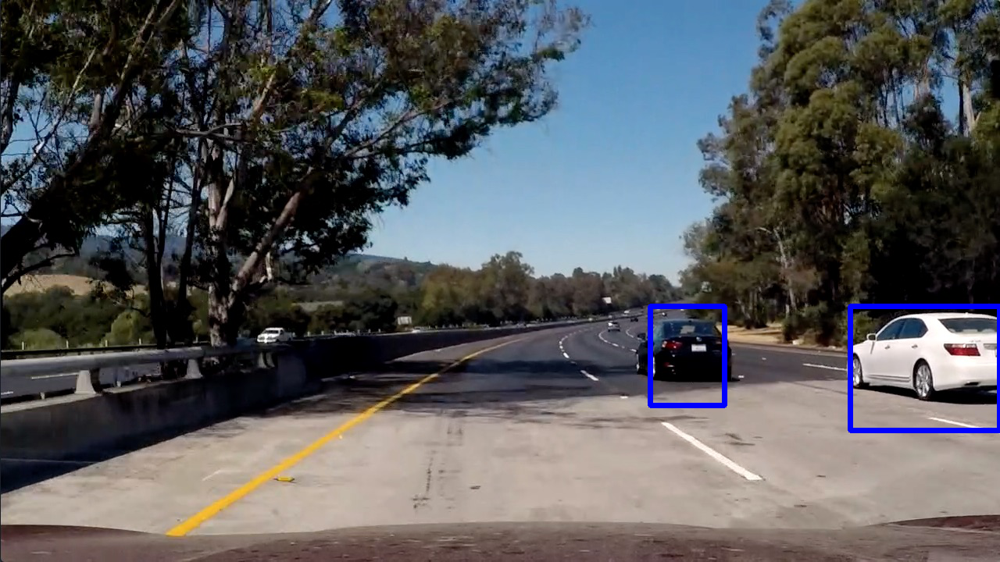
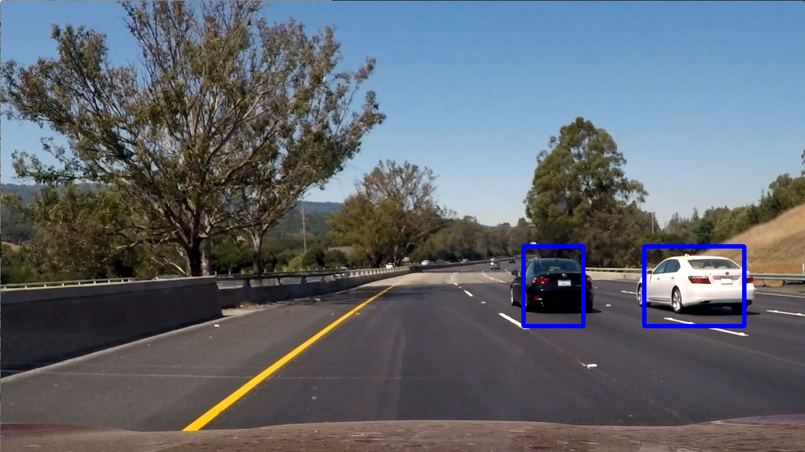

#Vehicle Detection Project

The goals / steps of this project are the following:

* Perform a Histogram of Oriented Gradients (HOG) feature extraction on a labeled training set of images and train a classifier Linear SVM classifier
* Optionally, you can also apply a color transform and append binned color features, as well as histograms of color, to your HOG feature vector. 
* Note: for those first two steps don't forget to normalize your features and randomize a selection for training and testing.
* Implement a sliding-window technique and use your trained classifier to search for vehicles in images.
* Run your pipeline on a video stream (start with the test_video.mp4 and later implement on full project_video.mp4) and create a heat map of recurring detections frame by frame to reject outliers and follow detected vehicles.
* Estimate a bounding box for vehicles detected.


##Histogram of Oriented Gradients (HOG)

####1. Explain how (and identify where in your code) you extracted HOG features from the training images.

I started by reading in all the `vehicle` and `non-vehicle` images.  Here is an example of one of each of the `vehicle` and `non-vehicle` classes:




I then explored different color spaces and different `skimage.hog()` parameters (`orientations`, `pixels_per_cell`, and `cells_per_block`).  I grabbed random images from each of the two classes and displayed them to get a feel for what the `skimage.hog()` output looks like.

Here is an example using the `YCrCb` color space and HOG parameters of `orientations=8`, `pixels_per_cell=(8, 8)` and `cells_per_block=(2, 2)`:


Please note, that I have modified the `extract_features(img)`-function
such that its second argument takes in the `Settings` class.  I have conducted this simple modification in order to increase readability and decrease errors and debugging time.


####2. Explain how you settled on your final choice of HOG parameters.

I tried various combinations of parameters and...

####3. Describe how (and identify where in your code) you trained a classifier using your selected HOG features (and color features if you used them).

I used a linear Support Vector Machine from the scikit-learn package.
Due to my relatively small machine, I chose to use the small sets of training data.  The data included about 4,000 labeled images.

The preprocessing is done in lines ?? to ??.  It involves a split into training and testing data with a train-to-test-ratio of about 0.2.  The test accuracy is about 0.??.

A separate function called 'pipeline' contains the image processing pipeline.  It takes an image (in case of a video, a series of images) and the classifier and scaler as data.  While the image and classifier are clear, the scaler is used for...

The standard `__name__=='__main__'` function only 
Depending on the command line arguments, one may choose between `-i` for image processing and `-v` for video processing, both options followed by the arguments for input files.

Choosing the image processing option yields an output 

The output can be by the two parameters
```
	height, width = (2, 1)
```

I took advantage of the Pythonesque feature of treating functions as objects and defined local variables by `pipeline.output`, where `output` is the name of an intermediate image.


##Sliding Window Search

####1. Describe how (and identify where in your code) you implemented a sliding window search.  How did you decide what scales to search and how much to overlap windows?

I decided to use three scales: 64x64px, 128x128px, and 256x256px.

The smallest scale is used in a ribbon at the horizon which is located between and ??.

The medium scale is located in a ribbon between and .

And finally, the largest scale is located in a ribbon between ?? and ?? px.


Using the 'functions are also objects' in Python, I can easily read them out for tweaking purposes in the `imageProcessing()` function.


####2. Show some examples of test images to demonstrate how your pipeline is working.  What did you do to optimize the performance of your classifier?

The pipeline is structured as follows:

Ultimately I searched on two scales using YCrCb 3-channel HOG features plus spatially binned color and histograms of color in the feature vector, which provided a nice result.  Here are some example images:



The corresponding heatmap:


The second test image, `test2.jpg`, did not result in any detection at all.

Applying `test3.jpg` to the pipeline:



Applying `test4.jpg` to the pipeline:



Applying `test5.jpg` to the pipeline:



Applying `test6.jpg` to the pipeline:



Architectually, I have defined a class `Settings` whose main purpose is to act as a struct for the parameters of the HOG classifier.


---

## Video Implementation

####1. Provide a link to your final video output.  Your pipeline should perform reasonably well on the entire project video (somewhat wobbly or unstable bounding boxes are ok as long as you are identifying the vehicles most of the time with minimal false positives.)

As described above, choosing the command line option `-v`, followed by an input file name, utilizes us the pipeline to process video images.
Since the pipeline in our version takes four arguments, I use the `lambda`-method to define a one-argument function 
```
	lambda frame: pipeline(frame, cls, X_scale, settings)
```


As output, I have made out of curiosity two different videos: One displaying cars with surrounding bounding boxes, and another one displaying the heat map.

The first link provides the reader with the standard bounding boxes:

Here's a [link to my video result](./boundingBoxVideo.mp4)

The second link leads to the video with the heat signature:

Here's a [link to my video result](./heatMapVideo.mp4)

One can see that our method for detecting false positives works quite well.


####2. Describe how (and identify where in your code) you implemented some kind of filter for false positives and some method for combining overlapping bounding boxes.

I recorded the positions of positive detections in each frame of the video.  From the positive detections I created a heatmap and then thresholded that map to identify vehicle positions.  I then used `scipy.ndimage.measurements.label()` to identify individual blobs in the heatmap.  I then assumed each blob corresponded to a vehicle.  I constructed bounding boxes to cover the area of each blob detected.  

Here's an example result showing the heatmap from a series of frames of video, the result of `scipy.ndimage.measurements.label()` and the bounding boxes then overlaid on the last frame of video:


The following two pictures illustrate the application of the pipeline onto `test1.jpg`, but without any threshold: 


Applying the corresponding bounding boxes:

Here is the output of `scipy.ndimage.measurements.label()` on the integrated heatmap from all six frames:


Here the resulting bounding boxes are drawn onto the last frame in the series:


The labels can be read out by `labels[1]` which gived us the 


---

##Discussion

####1. Briefly discuss any problems / issues you faced in your implementation of this project.  Where will your pipeline likely fail?  What could you do to make it more robust?

Here I'll talk about the approach I took, what techniques I used, what worked and why, where the pipeline might fail and how I might improve it if I were going to pursue this project further.  

Further improvements should focus on making the algorithm more efficient, i.e. make it more likely to being used for real-time applications.  In its current state, the pipeline is much too slow, in particular due to inefficient use of the sliding window technique.

While experimenting with different parameters and subroutines, I've learned that the `add_heat()`-function does consume a lot time.  At first, I have forgotten to add the small windows to the heatmap, but after I have corrected this mistake, the compilation of videos had become much slower.


One interesting feature to stabilize the tracking algorithm could be the use of temporal averaging.  This would require the use of a buffer for a few frames.  Especially real-time usages would require very fast algorithms due to 


I found the solution from the lectures rather unsatisfying, as there are too many arguments in the function.  This has certainly much to do with 

Although I was able to make some improvements architectually, there is still plenty of room for cleanup and .  In particular, I the parameter object `settings` should not be passed as often from function to function.  This would require only a few hours of optimization.  However, this work will be postponed until later.


